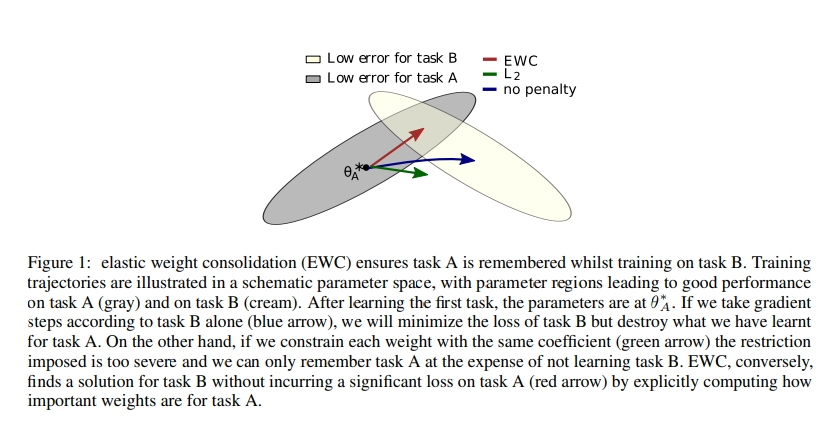

# 1. Catastrophic forgetting

- **신경망 모델은 이전 dataset으로 학습한 모델에 새로운 dataset을 학습하면 두 dataset 간에 관련이 있더라도 이전 dataset에 대한 정보를 대량으로 손실함**
- **새로운 task를 학습시킬 때 , 모델이 새로운 task를 풀도록 완전히 바뀌어 이전에 학습한 task를 잊어버리는 망각현상을 catastrophic forgetting 문제라고 함**
- 새로운 데이터셋으로 학습을 하면 이전 데이터셋과 관련이 있더라도 이전 데이터셋에 대한 정보를 대량으로 손실하게 됨
- A 데이터 90% → B 데이터 90% → A 데이터 테스트 30%

# 2. EWC(Elastic weight consolidation)

## 2-1. regularization approaches

- 모델의 가중치 업데이트에 constraint를 부과하여 Catastrophic forgetting를 완화하는 접근 방법임
- 모델의 loss에 이전 task와 새로운 task로 학습한 모델에 가중치 변화에 패널티를 부여하는 regularization term을 추가함
- 이러한 방법 중 가장 유명한 방법이 EWC임

## 2-2. EWC VS L2 Regularization VS no penalty

- 인간의 synaptic consolidation을 차용해 이전에 학습한 가중치 중 중요한 가중치의 변화를 줄이는 방향으로 새로운 task를 학습함

- synaptic consolidation: 뇌에서 이전에 학습한 정보 중 중요한 정보의 신경가소성을 감소시킴으로써 continual learning을 가능하게 하는 매커니즘

- regularization term을 이용해서 새로운 task를 학습할 때 이전에 학습했던 optimal parameter로부터 크게 벗어나는 것을 방지하여 catastrophic forgetting을 완화하고자함

- 

  

%20181a2572b45e4de499efb480f8152867/%25EC%259D%25B4%25EB%25AF%25B8%25EC%25A7%2580_0905038.jpg)

%20181a2572b45e4de499efb480f8152867/%25EC%259D%25B4%25EB%25AF%25B8%25EC%25A7%2580_0913004.jpg)

\theta_{A}^{*}: Task A 학습 한 후 parameters는 \theta_{A}^{*}에 있음(After learning the first task, the parameters are at  \theta_{A}^{*})

- 일반적으로 사용하는 l2 regularization term은 generalization을 하는데
- 회색 부분은 Task A를 학습할 때의 optimal weight space라고 보고 노란 부분을 Task B를 학습할 때의 optimal weight space라고 볼 때

**1) CASE1(패널티를 주지 않은 경우):** Task A를 학습했을 때 A를 학습한 모델을 initialization을 이용해서 B를 학습시키면 Task B에 optimal한 weight를 학습하여 아예 weight space가 변경 됨

- Task A와 B가 있다고 할 때, B를 학습할 때 A를 잊는데 이러한 학습 과정은 아래와 같이 쓰여질 수 있음

%20181a2572b45e4de499efb480f8152867/%25EC%259D%25B4%25EB%25AF%25B8%25EC%25A7%2580_0913001.jpg)

**2) CASE2(L2 regularization term):** generalization 되어서 둘의 사이 부분으로 초록색을 통해 파라미터가 이동됨

- A에 대해 forgetting을 피하기 위해, \theta와 \theta_{A}^{*}간의 distance를 줄이고자 하는 과정이 l2
- \alpha는 새로운 task B에 비교하여 old task인 A가 얼마나 중요한지에 대한 값임

%20181a2572b45e4de499efb480f8152867/%25EC%259D%25B4%25EB%25AF%25B8%25EC%25A7%2580_0913002.jpg)

**3) CASE3(EWC regularization term):** 이전에 학습한 Task A에서 중요한 weight들은 변경되지 않는 방향으로 Task B를 학습하기 때문에 빨강색 화살표처럼 Task A에 optimal과 Task B의 optimal을 보존하는 방향으로 weight를 학습하게 됨

- l2에서는 각각의 파라미터가 같게 다뤄짐
- Fisher Information matrix에서의 diagonal components를 사용하여 어떤 parameter가 Task A에게 더 중요한지를 판별해내고 그것들에 더 높은 weights를 주게 함
- I_{i}는 Fisher information matrix의 diagonal이고, i는 각각의 parameter를 의미함
- I_{i}는 parameter \theta_{i}가 old task A에게 중요한지 아닌지를 알려줌
- I_{i}를 계산하기 위해서 Task A로부터 data를 sampling하고 empirical Fisher Information matrix를 계산함

%20181a2572b45e4de499efb480f8152867/%25EC%259D%25B4%25EB%25AF%25B8%25EC%25A7%2580_0913003.jpg)

- Task A 학습하고 난 후의 파라미터와 현재 파라미터 간의 distance의 제곱을 구하고 I는 Task A에게 현재 파라미터가 중요한지를 보여주는 지표

## 2-3. 파라미터 중요성 판단 기준

### 1) 판단기준

- EWC는 이전에 학습한 파라미터 중에서 중요하다고 생각되는 파라미터의 업데이트를 방지하는 과정을 통해서 이전 Task의 정보를 유지하기 때문에 파라미터의 중요성을 판단하는 기준이 중요함
- EWC에서 파라미터의 중요성을 판단하는 기준은 다음과 같음
  
    %20181a2572b45e4de499efb480f8152867/%25EC%259D%25B4%25EB%25AF%25B8%25EC%25A7%2580_0905025.jpg)
    
- 데이터가 주어졌을 때, 파라미터가 등장할 확률임
- 즉, 이것이 파라미터가 얼마나 중요한지를 나타낸다고 함

### 2) 조건부확률식을 거쳐 3가지 term 생성

- 좌측식은 조건부 확률식에 의해 우측식처럼 3가지 term으로 나타남
  
    %20181a2572b45e4de499efb480f8152867/%25EC%259D%25B4%25EB%25AF%25B8%25EC%25A7%2580_0905026.jpg)
    
- Task가 여러개로 주어지는데 여기서 Task A와 Task B가 independent한 데이터이고 그 데이터와 Large D 데이터를 구성하는 subset이라고 봤을 때 아래와 같이 볼 수 있음
  
    %20181a2572b45e4de499efb480f8152867/%25EC%259D%25B4%25EB%25AF%25B8%25EC%25A7%2580_0905027.jpg)
    
- 이 과정에서 조건부 확률의 특징을 이용해서 풀게 되면 아래와 같이 3가지 term으로 나눠짐
  
    %20181a2572b45e4de499efb480f8152867/%25EC%259D%25B4%25EB%25AF%25B8%25EC%25A7%2580_0905028.jpg)
    
- 3가지 term에 대한 의미

1) logp(D_{B}|\theta) : task B에 대한 loss

2) logp(\theta|D_{A}) : task A에서의 \theta의 posterior

logp(\theta|D)는 데이터가 주어졌을 때 파라미터가 얼마나 중요한지를 의미를 하기 때문에 logp(\theta|D_{A})는 Task A에서 어느 파라미터가 중요한지에 대한 정보를 담고 있으므로 매우 중요함

파라미터의 중요성을 판단하기 위해 2)를 알아야함 

하지만 이러한 posterior는 알려져 있지 않기 때문에 approximation을 통해서 분포를 추정해야함 

EWC에서는 이러한 추정을 위해서 Laplace Approximation을 사용하여 2)를 Gaussian distribution으로 변경함

### 3) 2번째 Term에 대한 근사를 위한 Laplace approximation

**(1) Laplace approximation 방법**

%20181a2572b45e4de499efb480f8152867/%25EC%259D%25B4%25EB%25AF%25B8%25EC%25A7%2580_0905029.jpg)

1) 특정점에서 guassian distribution에 근사하는 방법임

2) log분포의 최빈값을 찾고 그 점을 평균으로 2차식 형태로 근사시키는 과정을 통해 분포를 추정함

- 좌측에서 guassian 분포는 빨간 종모양을 가지게 되고 이 종 모양의 분포는 평균에서 양쪽 대칭 모양을 가지게 됨
- 노란 분포는 가우시안으로 근사해야하는 분포인데 여기서 평균에 해당하는 최빈값을 점으로 잡고 이 점을 기준으로 가우시안 분포를 근사하게 됨
- 가우시안 분포는 exponential을 가지고 있기 때문에 log 분포를 취하면 2차식 형태로 근사되게 됨
- 2차식의 형태를 가지는 노란선에서 최빈값(미분0값)을 찾고 그 부분을 기점으로 2차식으로 근사하게 되면 실제 분포를 가우시안 분포로  근사하는 효과를 가짐

**(2) 2번째 term에 적용**

%20181a2572b45e4de499efb480f8152867/%25EC%259D%25B4%25EB%25AF%25B8%25EC%25A7%2580_0905030.jpg)

- laplace approximation은 2가지 스텝에 의해서 진행됨
- Step1: logp(\theta|D_{A})에 대한 최빈값을 찾기 위해서 미분 했을 때 0이 되는 \theta^{*}_{A}를 찾음
- Step2: \theta^{*}_{A}를 찾게 되면 \theta^{*}_{A}를 평균으로 해서 2차식에 해당하는 로그 분포를 근사하게 됨
- 이를 통해  logp(\theta|D_{A})를 추정할 수 있게 됨, 이것이 파라미터의 중요성을 나타냄

%20181a2572b45e4de499efb480f8152867/%25EC%259D%25B4%25EB%25AF%25B8%25EC%25A7%2580_0907001.jpg)

- 즉, 2번째 term인 posterior을 파라미터 \theta^{*}_{A} 를 평균으로 하고 , Fisher information matrix F의 diagonal으로 주어진 diaonal precision을 가지고 Gaussian 분포로 추정함
- F를 계산하기 위해서 Task A로부터 data를 sampling하고 empirical Fisher Information matrix를 계산함 → 이를 통해 task A에게 \theta_{i}가 중요한 파라미터인지에 대한 정보를 가지고 있음

### 2.4. Loss function

%20181a2572b45e4de499efb480f8152867/%25EC%259D%25B4%25EB%25AF%25B8%25EC%25A7%2580_0905032.jpg)

- 기존의 Task를 위한 모델과 새로 학습할 Task를 비교하는 과정이 EWC의 Loss function에 들어감
- F: 매개변수 \theta_{i}의 이전 학습 데이터에 대한 상관도 (F를 계산할 때 Fisher Information matrix를 활용함, 이는 어떤 Random variable의 관측값으로부터 분포의 parameter에 대해 유추할 수 있는 정보의 양을 의미함)
- \mathcal L_{B}(\theta): 오직 Task B에 대한 loss, 현재 학습 데이터에 대한 비용함수
- \lambda: old task가 새로운 task와 비교하여 얼마나 중요한지를 결정함, 이전 학습 데이터에 가중을
얼마나 줄지 결정하는 값, 어떠한 매개변수가 이전 학습 데이터와 상관도가 높다면 이 매개변수의 변화에 높은 제약이 주어지게 되므로 변화를 억제할 수 있음
- i: 각각의 parameter를 의미, 각 매개변수의 라벨

### 2-5. 구조

%20181a2572b45e4de499efb480f8152867/%25EC%259D%25B4%25EB%25AF%25B8%25EC%25A7%2580_0905019.jpg)

- EWC는 regularization term을 이용해서 retraining을 하되 expansion은 하지 않음

# 3. 구현코드

EWC 구현

1.과거 task에 중요한 weight를 변경하지 못하도록 cost term을 사용하며 이를 계산하기 위해 fisher information을 사용함 

2. penalty 부여

- Task A 학습하고 난 후의 파라미터와 현재 파라미터 간의 distance의 제곱을 구하고 I는 Task A에게 현재 파라미터가 중요한지를 보여주는 지표

## 구현 코드 Ver.1

Step1: fisher를 계산하기 위해 accumulated gradients를 사용함

- 이때 sampling을 하거나 mini batch를 사용함

Step2: fisher를 넣은 새로운 loss function을 학습에 사용함

```python
from copy import deepcopy
import torch
from torch import nn
from torch.nn import functional as F
from torch.autograd import Variable
import torch.utils.data

def variable(t: torch.Tensor, use_cuda=True, **kwargs):
    if torch.cuda.is_available() and use_cuda:
        t = t.cuda()
    return Variable(t, **kwargs)

class EWC(object):
    def __init__(self, model: nn.Module, dataset: list):

        self.model = model
        self.dataset = dataset

        # named_parameters :  (name, parameter) 조합
        self.params = {n: p for n, p in self.model.named_parameters() if p.requires_grad}
        self._means = {}
        self._precision_matrices = self._diag_fisher()

      # 1) Task A를 학습하고 난 후의 파라미터
        for n, p in deepcopy(self.params).items():
            self._means[n] = variable(p.data)

    def _diag_fisher(self):
      # 2) precision_matrices 0 초기화
        precision_matrices = {}
        for n, p in deepcopy(self.params).items():
            p.data.zero_()       # zero_ 0으로 채움
            precision_matrices[n] = variable(p.data)

			# 3) accumulate gradients to calculate fisher
        self.model.eval()
        for input in self.dataset:
            self.model.zero_grad()
            input = variable(input)
            output = self.model(input).view(1, -1)
            label = output.max(1)[1].view(-1)
            loss = F.nll_loss(F.log_softmax(output, dim=1), label)
            loss.backward()

     # 4) diag_fisher
     # diag_fisher는 Task A에게 현재 파라미터가 얼마나 중요한지를 보여주는 지표
     # diag_fisher를 계산하기 위해 Task A로부터 data를 샘플링하고 empirical Fisher information matrix를 계산함
     # 매개변수의 이전 학습 데이터에 대한 상관도(F를 계산할 때 Fisher information matrix 활용/
        # 어떤 random variable의 관측값으로부터 분포의 parameter에 대해 유추할 수 있는 정보의 양)
     # gradients의 제곱을 축적함
     # (parameter ** 2)/len(dataset) 
     # parameter.grad : 어떤 스칼라 값에 대해 parameter에 대해 변화도를 갖는 값/ 모델의 각 매개변수에 대한 gradeint
     # parameter.grad.data : tensor

            for n, p in self.model.named_parameters():
                precision_matrices[n].data += p.grad.data ** 2 / len(self.dataset)

        precision_matrices = {n: p for n, p in precision_matrices.items()}
        return precision_matrices

    # 5) penalty
    # diag_fisher의 diag*(Task A를 학습하고 난 후의 파라미터인 _means와 현재 파라미터의 차이의 제곱)를 통해 penalty 항을 만듦
    
    def penalty(self, model: nn.Module):
        loss = 0
        for n, p in model.named_parameters():
            _loss = self._precision_matrices[n] * (p - self._means[n]) ** 2
            loss += _loss.sum()
        return loss

def normal_train(model: nn.Module, optimizer: torch.optim, data_loader: torch.utils.data.DataLoader):
    model.train()
    epoch_loss = 0
    for input, target in data_loader:
        input, target = variable(input), variable(target)
        optimizer.zero_grad()
        output = model(input)
        loss = F.cross_entropy(output, target)
        epoch_loss += loss.data[0]
        loss.backward()
        optimizer.step()
    return epoch_loss / len(data_loader)

def ewc_train(model: nn.Module, optimizer: torch.optim, data_loader: torch.utils.data.DataLoader,
              ewc: EWC, importance: float):
    model.train()
    epoch_loss = 0
    for input, target in data_loader:
        input, target = variable(input), variable(target)
        optimizer.zero_grad()
        output = model(input)
        # EWC의 loss= (1) Task B에 대한 loss + (2) importance * (3) penalty항: 매개변수의 이전 학습 데이터에 대한 상관도
        # (1) Task B에 대한 loss(현재 학습 데이터에 대한 비용함수) 
        # (2) importance(old task가 새로운 task와 비교하여 얼마나 중요한지를 결정): 람다역할
        # (3) penalty항: diag_fisher의 diag*(Task A를 학습하고 난 후의 파라미터인 _means와 현재 파라미터의 차이의 제곱)
        loss = F.cross_entropy(output, target) + importance * ewc.penalty(model)
        epoch_loss += loss.data[0]
        loss.backward()
        optimizer.step()
    return epoch_loss / len(data_loader)

def test(model: nn.Module, data_loader: torch.utils.data.DataLoader):
    model.eval()
    correct = 0
    for input, target in data_loader:
        input, target = variable(input), variable(target)
        output = model(input)
        correct += (F.softmax(output, dim=1).max(dim=1)[1] == target).data.sum()
    return correct / len(data_loader.dataset)
```

## 구현 코드 Ver.2

```python
import torch
torch.cuda.is_available()
import torch
import torch.nn as nn
import torchvision.datasets as datasets
import torchvision.transforms as transforms
import torch.optim as optim
import torch.nn.functional as F
import numpy as np
import matplotlib.pyplot as plt

# switch to False to use CPU
use_cuda = True
use_cuda = use_cuda and torch.cuda.is_available()
device = torch.device("cuda" if use_cuda else "cpu");
torch.manual_seed(1);
```

```python
class Net(nn.Module):
    def __init__(self):
        super(Net, self).__init__()
        self.conv1 = nn.Conv2d(1, 10, kernel_size=5)
        self.conv2 = nn.Conv2d(10, 20, kernel_size=5)
        self.conv2_drop = nn.Dropout2d()
        self.fc1 = nn.Linear(320, 50)
        self.fc2 = nn.Linear(50, 10)

    def forward(self, x):
        x = F.relu(F.max_pool2d(self.conv1(x), 2))
        x = F.relu(F.max_pool2d(self.conv2_drop(self.conv2(x)), 2))
        x = x.view(-1, 320)
        x = F.relu(self.fc1(x))
        x = F.dropout(x, training=self.training)
        x = self.fc2(x)
        return x

model = Net().to(device)
optimizer = optim.SGD(model.parameters(), lr=0.01, momentum=0.9)
```

```python
fisher_dict = {}
optpar_dict = {}
ewc_lambda = 0.4
```

```python
# fisher와 Task A에 대한 파라미터
def on_task_update(task_id, x_mem, t_mem):

  model.train()
  optimizer.zero_grad()
  
  # accumulating gradients
  for start in range(0, len(t_mem)-1, 256):
      end = start + 256
      x, y = torch.from_numpy(x_mem[start:end]), torch.from_numpy(t_mem[start:end]).long()
      x, y = x.to(device), y.to(device)
      output = model(x)
      loss = F.cross_entropy(output, y)
      loss.backward()

  fisher_dict[task_id] = {}
  optpar_dict[task_id] = {}

  # gradients accumulated can be used to calculate fisher
  for name, param in model.named_parameters():
    
    optpar_dict[task_id][name] = param.data.clone()             # Task A에 대한 parameter
    fisher_dict[task_id][name] = param.grad.data.clone().pow(2) # fisher
```

```python
# 새로운 regularization term을 학습에 넣음
def train_ewc(model, device, task_id, x_train, t_train, optimizer, epoch):
    model.train()

    for start in range(0, len(t_train)-1, 256):
      end = start + 256
      x, y = torch.from_numpy(x_train[start:end]), torch.from_numpy(t_train[start:end]).long()
      x, y = x.to(device), y.to(device)
      
      optimizer.zero_grad()

      output = model(x)
      loss = F.cross_entropy(output, y)
      

      # EWC의 loss= (1) Task B에 대한 loss + (2) ewc_lambda * (3) penalty항: 매개변수의 이전 학습 데이터에 대한 상관도
      # (1) Task B에 대한 loss(현재 학습 데이터에 대한 비용함수) 
      # (2) ewc_lambda(old task가 새로운 task와 비교하여 얼마나 중요한지를 결정): 람다역할
      # (3) penalty항: diag_fisher의 diag*(Task A를 학습하고 난 후의 파라미터인 optpar와 현재 파라미터의 차이의 제곱)
        
      for task in range(task_id):
        for name, param in model.named_parameters():  # param: 현재 시점의 파라미터
          fisher = fisher_dict[task][name]   
          optpar = optpar_dict[task][name]    
          loss += (fisher * (optpar - param).pow(2)).sum() * ewc_lambda
      
      loss.backward()
      optimizer.step()
      #print(loss.item())
    print('Train Epoch: {} \tLoss: {:.6f}'.format(epoch, loss.item()))
```

```python
# data 
!git clone https://github.com/ContinualAI/colab.git continualai/colab

from continualai.colab.scripts import mnist
mnist.init()
x_train, t_train, x_test, t_test = mnist.load()
print("x_train dim and type: ", x_train.shape, x_train.dtype)
print("t_train dim and type: ", t_train.shape, t_train.dtype)
print("x_test dim and type: ", x_test.shape, x_test.dtype)
print("t_test dim and type: ", t_test.shape, t_test.dtype)

def permute_mnist(mnist, seed):
    """ Given the training set, permute pixels of each img the same way. """

    np.random.seed(seed)
    print("starting permutation...")
    h = w = 28
    perm_inds = list(range(h*w))
    np.random.shuffle(perm_inds)
    # print(perm_inds)
    perm_mnist = []
    for set in mnist:
        num_img = set.shape[0]
        flat_set = set.reshape(num_img, w * h)
        perm_mnist.append(flat_set[:, perm_inds].reshape(num_img, 1, w, h))
    print("done.")
    return perm_mnist

# task 1
task_1 = [(x_train, t_train), (x_test, t_test)]

# task 2
x_train2, x_test2 = permute_mnist([x_train, x_test], 1)
task_2 = [(x_train2, t_train), (x_test2, t_test)]

# task 3
x_train3, x_test3 = permute_mnist([x_train, x_test], 2)
task_3 = [(x_train3, t_train), (x_test3, t_test)]

# task list
tasks = [task_1, task_2, task_3]
```

```python
def train(model, device, x_train, t_train, optimizer, epoch):
    model.train()
    
    for start in range(0, len(t_train)-1, 256):
      end = start + 256
      x, y = torch.from_numpy(x_train[start:end]), torch.from_numpy(t_train[start:end]).long()
      x, y = x.to(device), y.to(device)
      
      optimizer.zero_grad()

      output = model(x)
      loss = F.cross_entropy(output, y)
      loss.backward()
      optimizer.step()
      #print(loss.item())
    print('Train Epoch: {} \tLoss: {:.6f}'.format(epoch, loss.item()))

def test(model, device, x_test, t_test):
    model.eval()
    test_loss = 0
    correct = 0
    for start in range(0, len(t_test)-1, 256):
      end = start + 256
      with torch.no_grad():
        x, y = torch.from_numpy(x_test[start:end]), torch.from_numpy(t_test[start:end]).long()
        x, y = x.to(device), y.to(device)
        output = model(x)
        test_loss += F.cross_entropy(output, y).item() # sum up batch loss
        pred = output.max(1, keepdim=True)[1] # get the index of the max logit
        correct += pred.eq(y.view_as(pred)).sum().item()

    test_loss /= len(t_test)
    print('Test set: Average loss: {:.4f}, Accuracy: {}/{} ({:.0f}%)\n'.format(
        test_loss, correct, len(t_test),
        100. * correct / len(t_test)))
    return 100. * correct / len(t_test)
```

```python
# Finally we can run the train over the three tasks sequence of th Permuted MNIST:
ewc_accs = []
for id, task in enumerate(tasks):
  avg_acc = 0
  print("Training on task: ", id)
  
  (x_train, t_train), _ = task
  
  for epoch in range(1, 3):
    train_ewc(model, device, id, x_train, t_train, optimizer, epoch)
  on_task_update(id, x_train, t_train)
    
  for id_test, task in enumerate(tasks):
    print("Testing on task: ", id_test)
    _, (x_test, t_test) = task
    acc = test(model, device, x_test, t_test)
    avg_acc = avg_acc + acc
   
  print("Avg acc: ", avg_acc / 3)
  ewc_accs.append(avg_acc / 3)
```

```python
plt.plot([1, 2, 3], ewc_accs, '-o', label="EWC")
plt.xlabel('Tasks Encountered', fontsize=14)
plt.ylabel('Average Accuracy', fontsize=14)
plt.title('CL Strategies Comparison on MNIST', fontsize=14);
plt.xticks([1, 2, 3])
plt.legend(prop={'size': 16});
```

%20181a2572b45e4de499efb480f8152867/%25EC%259D%25B4%25EB%25AF%25B8%25EC%25A7%2580_0914001.jpg)

## 구현 코드 Ver.3

```python
import torch
import random
# from .default import NormalNN

# L2 part와 EWC part로 구분되며, EWC는 L2를 상속받음

# 1. L2 Part
# 1) penalty loss fuction 진행: 
# EWC의 loss= (1) Task B에 대한 loss + (2) importance * (3) penalty항: 매개변수의 이전 학습 데이터에 대한 상관도
# (1) Task B에 대한 loss(현재 학습 데이터에 대한 비용함수) 
# (2) importance(old task가 새로운 task와 비교하여 얼마나 중요한지를 결정): 람다역할
# (3) penalty항: diag_fisher의 diag*(Task A를 학습하고 난 후의 파라미터와 현재 파라미터의 차이의 제곱)

# 2. EWC Part 
# 1) weight의 중요도 측정하여 과거 Task에 중요한 weight를 변경하지 못하도록 loss에 추가함
# 2) weight의 중요도는 fisher information을 사용함

class L2(NormalNN):
    """
    @article{kirkpatrick2017overcoming,
        title={Overcoming catastrophic forgetting in neural networks},
        author={Kirkpatrick, James and Pascanu, Razvan and Rabinowitz, Neil and Veness, Joel and Desjardins, Guillaume and Rusu, Andrei A and Milan, Kieran and Quan, John and Ramalho, Tiago and Grabska-Barwinska, Agnieszka and others},
        journal={Proceedings of the national academy of sciences},
        year={2017},
        url={https://arxiv.org/abs/1612.00796}
    }
    """
    def __init__(self, agent_config):
        super(L2, self).__init__(agent_config)
        self.params = {n: p for n, p in self.model.named_parameters() if p.requires_grad}  # For convenience
        self.regularization_terms = {}
        self.task_count = 0
        self.online_reg = True  # True: There will be only one importance matrix and previous model parameters
                                # False: Each task has its own importance matrix and model parameters

    def calculate_importance(self, dataloader):
        # Use an identity importance so it is an L2 regularization.
        importance = {}
        for n, p in self.params.items():
            importance[n] = p.clone().detach().fill_(1)  # Identity
        return importance

    def learn_batch(self, train_loader, val_loader=None):

        self.log('#reg_term:', len(self.regularization_terms))

        # 1.Learn the parameters for current task
        super(L2, self).learn_batch(train_loader, val_loader)

        # 2.Backup the weight of current task
        task_param = {}
        for n, p in self.params.items():
            task_param[n] = p.clone().detach()

        # 3.Calculate the importance of weights for current task
        importance = self.calculate_importance(train_loader)

        # Save the weight and importance of weights of current task
        self.task_count += 1
        if self.online_reg and len(self.regularization_terms)>0:
            # Always use only one slot in self.regularization_terms
            self.regularization_terms[1] = {'importance':importance, 'task_param':task_param}
        else:
            # Use a new slot to store the task-specific information
            self.regularization_terms[self.task_count] = {'importance':importance, 'task_param':task_param}

    def criterion(self, inputs, targets, tasks, regularization=True, **kwargs):
        loss = super(L2, self).criterion(inputs, targets, tasks, **kwargs)

        if regularization and len(self.regularization_terms)>0:
            # Calculate the reg_loss only when the regularization_terms exists
            reg_loss = 0
            for i,reg_term in self.regularization_terms.items():
                task_reg_loss = 0
                importance = reg_term['importance']
                task_param = reg_term['task_param']
                for n, p in self.params.items():
                    task_reg_loss += (importance[n] * (p - task_param[n]) ** 2).sum() # penalty
                reg_loss += task_reg_loss
            loss += self.config['reg_coef'] * reg_loss
        return loss

# EWC가 L2 상속
class EWC(L2):
    """
    @article{kirkpatrick2017overcoming,
        title={Overcoming catastrophic forgetting in neural networks},
        author={Kirkpatrick, James and Pascanu, Razvan and Rabinowitz, Neil and Veness, Joel and Desjardins, Guillaume and Rusu, Andrei A and Milan, Kieran and Quan, John and Ramalho, Tiago and Grabska-Barwinska, Agnieszka and others},
        journal={Proceedings of the national academy of sciences},
        year={2017},
        url={https://arxiv.org/abs/1612.00796}
    }
    """

    def __init__(self, agent_config):
        super(EWC, self).__init__(agent_config)
        self.online_reg = False
        self.n_fisher_sample = None
        self.empFI = False

    # 1.* Weight의 중요도를 측정하는 부분: fisher information
    def calculate_importance(self, dataloader):
        # Update the diag fisher information
        # There are several ways to estimate the F matrix.
        # We keep the implementation as simple as possible while maintaining a similar performance to the literature.
        self.log('Computing EWC')

        # 1) ** Initialize the importance matrix
        if self.online_reg and len(self.regularization_terms)>0:
            importance = self.regularization_terms[1]['importance']
        else: # 0으로 초기화
            importance = {}
            for n, p in self.params.items():
                importance[n] = p.clone().detach().fill_(0)  # zero initialized

        # 2) ** fisher information을 추정하기 위해 data의 subset을 sampling함
        # Sample a subset (n_fisher_sample) of data to estimate the fisher information (batch_size=1)
        # Otherwise it uses mini-batches for the estimation. This speeds up the process a lot with similar performance.
        if self.n_fisher_sample is not None:
            n_sample = min(self.n_fisher_sample, len(dataloader.dataset))
            self.log('Sample',self.n_fisher_sample,'for estimating the F matrix.')
            rand_ind = random.sample(list(range(len(dataloader.dataset))), n_sample)
            subdata = torch.utils.data.Subset(dataloader.dataset, rand_ind)
            dataloader = torch.utils.data.DataLoader(subdata, shuffle=True, num_workers=2, batch_size=1)

        mode = self.training
        self.eval()

        # 3)** fisher information을 구하기 위해 gradients의 제곱을 축적
        # Accumulate the square of gradients
        for i, (input, target, task) in enumerate(dataloader):
            if self.gpu:
                input = input.cuda()
                target = target.cuda()

            preds = self.forward(input)

            # Sample the labels for estimating the gradients
            # For multi-headed model, the batch of data will be from the same task,
            # so we just use task[0] as the task name to fetch corresponding predictions
            # For single-headed model, just use the max of predictions from preds['All']
            task_name = task[0] if self.multihead else 'All'

            # The flag self.valid_out_dim is for handling the case of incremental class learning.
            # if self.valid_out_dim is an integer, it means only the first 'self.valid_out_dim' dimensions are used
            # in calculating the loss.
            pred = preds[task_name] if not isinstance(self.valid_out_dim, int) else preds[task_name][:,:self.valid_out_dim]
            ind = pred.max(1)[1].flatten()  # Choose the one with max

            # - Alternative ind by multinomial sampling. Its performance is similar. -
            # prob = torch.nn.functional.softmax(preds['All'],dim=1)
            # ind = torch.multinomial(prob,1).flatten()

            if self.empFI:  # Use groundtruth label (default is without this)
                ind = target

            loss = self.criterion(preds, ind, task, regularization=False)
            self.model.zero_grad()
            loss.backward()
            for n, p in importance.items():
                if self.params[n].grad is not None:  # Some heads can have no grad if no loss applied on them.
                    p += ((self.params[n].grad ** 2) * len(input) / len(dataloader))

        self.train(mode=mode)

        return importance

def EWC_online(agent_config):
    agent = EWC(agent_config)
    agent.online_reg = True
    return agent

```

## References

**[논문]**

**[1] J. Kirkpatrick, et al., “Overcoming catastrophic forgetting in neural networks,” Proc. Nat. Acad. Sci., vol. 114, no. 13, pp. 3521–3526, 2017.**

[https://arxiv.org/pdf/1612.00796.pdf](https://arxiv.org/pdf/1612.00796.pdf)

[https://koreascience.kr/article/JAKO202105653790682.pdf](https://koreascience.kr/article/JAKO202105653790682.pdf)

**[유튜브 영상]**

[https://www.youtube.com/watch?v=WakxMwYHG4o&t=1797s](https://www.youtube.com/watch?v=WakxMwYHG4o&t=1797s)

**[코드]**

[https://github.com/moskomule/ewc.pytorch/blob/master/utils.py](https://github.com/moskomule/ewc.pytorch/blob/master/utils.py)

[https://github.com/ContinualAI/colab/blob/master/notebooks/intro_to_continual_learning.ipynb](https://github.com/ContinualAI/colab/blob/master/notebooks/intro_to_continual_learning.ipynb)

**[설명]**

[https://andrewliao11.github.io/blog/fisher-info-matrix/](https://andrewliao11.github.io/blog/fisher-info-matrix/)